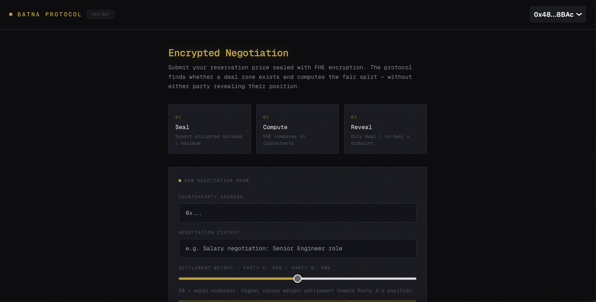
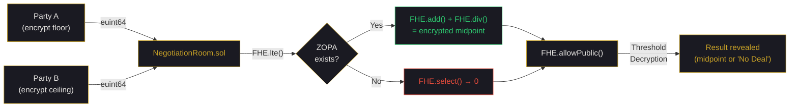

<p align="center">
  <strong>BATNA PROTOCOL</strong><br/>
  <em>Encrypted Negotiation Engine on Fhenix CoFHE</em>
</p>

<p align="center">
  <a href="#how-it-works">How It Works</a> &nbsp;|&nbsp;
  <a href="#why-fhe">Why FHE</a> &nbsp;|&nbsp;
  <a href="#wave-2--intent-based-ai-agents">AI Agents</a> &nbsp;|&nbsp;
  <a href="#architecture">Architecture</a> &nbsp;|&nbsp;
  <a href="#quick-start">Quick Start</a> &nbsp;|&nbsp;
  <a href="#tests">Tests</a> &nbsp;|&nbsp;
  <a href="#roadmap">Roadmap</a>
</p>

---

<p align="center">
  
</p>

> **The first negotiation where revealing your minimum first is no longer a disadvantage.**

Alice would accept **$130K**. The company would pay up to **$145K**. Neither knows the other's number.

The contract reveals: **_"Deal found at $137,500."_**

Nobody learns either party's actual reservation price. Not the blockchain. Not a server. Not even the other party.

---

## How It Works

```
   Party A (Floor)              Party B (Ceiling)
        |                             |
   encrypt($130K)               encrypt($145K)
        |                             |
        +──────── on-chain ───────────+
                    |
            NegotiationRoom.sol
                    |
         FHE.lte(encMinA, encMaxB)     ← ZOPA check on ciphertexts
         FHE.add(encMinA, encMaxB)     ← encrypted sum
         FHE.div(encSum, enc(2))       ← encrypted midpoint
         FHE.select(zopa, mid, zero)   ← conditional routing
                    |
              ┌─────┴─────┐
          ZOPA exists    No ZOPA
              |              |
       "Deal at $137.5K"   "No Deal"
       (midpoint only)   (nothing revealed)
```

Both reservation prices stay encrypted throughout. The contract computes the result on ciphertexts. Only the outcome is revealed.

## Why FHE

This is the core question: _would this work without FHE?_

**No.** Every alternative breaks:

| Approach            | Failure Mode                                                                        |
| ------------------- | ----------------------------------------------------------------------------------- |
| Trusted third party | Can leak, manipulate, or be compromised                                             |
| Commit-reveal       | Reveal phase exposes your number before counterparty commits                        |
| ZK proofs           | Can prove a number is in a range, but **cannot compute `(A+B)/2` on hidden values** |

FHE is the only cryptographic primitive where:

- Both values stay **encrypted** during comparison
- Arithmetic runs **on ciphertexts** (`add`, `div`, `lte`, `select`)
- Only the **result** is revealed via threshold decryption

This is not privacy bolted onto an existing product. This is a product that **cannot exist** without FHE.

### Encrypted State Flow



> **Every box above operates on ciphertexts.** Plaintext only appears at the final output — and only the result, never the inputs.

### Privacy Boundary — What Leaks, What Doesn't

| Data                            | Visibility   | Notes                                                                       |
| ------------------------------- | ------------ | --------------------------------------------------------------------------- |
| Party reservation prices        | **Hidden**   | Encrypted client-side via CoFHE SDK; never decrypted individually on-chain  |
| ZOPA existence (before publish) | **Hidden**   | Encrypted `ebool`; revealed only via threshold decryption after both submit |
| Final settlement result         | **Revealed** | Only after both parties submit + threshold network decrypts                 |
| Room metadata / context         | **Public**   | Stored as plaintext string on-chain                                         |
| Participant addresses           | **Public**   | On-chain, visible in contract state                                         |
| Submission timing               | **Public**   | Transaction timestamps visible on-chain                                     |
| Number of rooms / negotiations  | **Public**   | Factory tracks all rooms publicly                                           |
| Settlement weight               | **Public**   | Set at room creation, visible in contract state                             |

> **Design principle:** Individual reservation prices _never_ become decryptable — only the computed result does. Even the contract itself cannot read Party A's floor or Party B's ceiling.

### Side-Channel Resistance

The `_resolve()` function executes an **identical code path** regardless of whether a deal exists:

```solidity
// No if/else branching — FHE.select() computes both paths, picks one
encResult = FHE.select(zopaExists, encMidpoint, zeroValue);
```

Gas usage and execution trace are the same for deal/no-deal outcomes. An observer watching gas costs or execution metadata learns nothing about whether the negotiation succeeded.

### Confidential Auditability

Rooms can optionally designate an **auditor** address at creation. The auditor can decrypt the settlement result via `FHE.allow()`, but **never** the individual reservation prices:

```solidity
// Auditor sees: "Deal at $137,500" or "No Deal"
// Auditor CANNOT see: Party A's $130K floor or Party B's $145K ceiling
FHE.allow(encResult, auditor);
FHE.allow(encZopaExists, auditor);
// (intentionally NO allow() calls for encMinA / encMaxB)
```

**Invariant enforced + verifiable on-chain.** The contract exposes `auditorAccess()` which returns `(canSeeMinA, canSeeMaxB, canSeeResult, canSeeZopa)` by querying the CoFHE ACL directly via `FHE.isAllowed()`. The privacy invariant — `canSeeMinA == false && canSeeMaxB == false` — is asserted in the test suite after every resolution.

This enables institutional compliance — proving a negotiation was fair without revealing positions to the public.

### Safe Value Range (Overflow Analysis)

Settlement: `(minA * weightA + maxB * weightB) / 100` with `weightA + weightB = 100`.

The intermediate products must fit in `euint64`. Worst case: `max(minA, maxB) * 100`. Safe when both reservation prices are below `type(uint64).max / 100 ≈ 1.84e17`.

| Use case | Encoded value | vs safe threshold |
|---|---|---|
| Salary in USD | up to `3e5` | ✅ 12 orders below |
| OTC in USD cents / token | up to `1e9` | ✅ 8 orders below |
| M&A in integer USD millions | up to `1e9` | ✅ 8 orders below |
| Any realistic bilateral deal | `< 1e17` | ✅ Safe |

FHE cannot bounds-check encrypted inputs without decrypting them, so the safe range is a contract-level guarantee documented in `_resolve()` NatSpec. Edge-weight behavior (`weightA=0`, `weightA=100`) is covered by dedicated tests — the formula collapses to `minA` or `maxB` exactly.

## Wave 2 — Intent-Based AI Agents

**Humans submit intent. The protocol computes the deal.**

Wave 2 ships an agentic layer that reads free-form context (job description, deal memo, trading desk brief), derives a reservation price via Claude `claude-opus-4-6`, encrypts it client-side via the CoFHE SDK, and submits it to `NegotiationRoom.submitReservationAsAgent(...)` — which emits an on-chain `AgentSubmission` event so the agent's provenance is verifiable forever.

### Two modes

| Mode | Who derives | Who encrypts | Who submits |
|---|---|---|---|
| **Manual** (Wave 1) | Human | Human (browser WASM) | Human wallet |
| **Solo Agent** (Wave 2) | Claude (via `/api/agent/derive`) | Human (browser WASM) | Human wallet |
| **Two-Agent Battle** (Wave 2) | Claude × 2 (server-side) | Server (Node CoFHE SDK) | Two ephemeral demo wallets |

### Two-Agent Battle flow

```
Browser             Next.js API              Arbitrum Sepolia
   |                    |                          |
   |  Start Battle      |                          |
   | ─────────────────▶ |                          |
   |                    | derive A + B (Claude)    |
   |                    | factory.createRoom()     |
   |                    | ──────────────────────▶  |
   |                    | encryptSubmit(A) ──────▶ | PartySubmitted + AgentSubmission
   |                    | encryptSubmit(B) ──────▶ | PartySubmitted + AgentSubmission
   |                    |                          | _resolve() on ciphertexts
   |  poll /status      |                          |
   | ◀───────────────── |                          |
   | deriving_a → submitted_a → resolved           |
```

The Anthropic API key never leaves the server. Each battle runs both sides autonomously — the browser only watches.

### Templates shipped in Wave 2

| Template | Role framing | Unit |
|---|---|---|
| `SALARY` | Candidate (floor) vs Employer (ceiling) | Integer USD |
| `OTC` | Seller (floor) vs Buyer (ceiling) | Integer cents per unit (euint64-safe) |
| `MA` | Seller board (floor) vs Acquirer (ceiling) | Integer USD millions |

Templates are a registry — adding new use cases is a one-file drop.

### Contract iteration

Wave 2 extends `NegotiationRoom.sol` with:

- `enum NegotiationType { GENERIC, SALARY, OTC, MA }` + `negotiationType` storage (on-chain routing signal)
- `uint256 public deadline` + `notExpired` modifier (submissions revert past the deadline)
- `submitReservationAsAgent(InEuint64, address agent)` — same logic as `submitReservation`, plus emits `AgentSubmission(party, agent)`
- Factory `createRoom` passes deadline + type through to the room

All Wave 1 tests stay green (deadline defaults to `0` = never expires, type defaults to `SALARY`).

### Why this matters

Every negotiation — salary, M&A, real estate, even geopolitical ceasefires — reduces to the same math: _do two hidden ranges overlap?_ With AI agents deriving the numbers, **any negotiation described in words becomes encrypted arithmetic:**

| Scenario         | What the AI Agent Does                                                      |
| ---------------- | --------------------------------------------------------------------------- |
| **Salary**       | Reads job description + market data → encrypted floor/ceiling               |
| **M&A**          | Analyzes financials → encrypted max offer / min accept                      |
| **OTC**          | Computes fair spread → encrypted bid/ask on euint64 cents                   |
| **Geopolitical** | Analyzes strategic position, sanctions, domestic pressure → encrypted terms |

> Consider US-Iran tensions: neither side can state acceptable concessions without appearing weak. AI agents derive encrypted terms from each side's strategic position. If ranges overlap, a framework emerges. If not, neither side learns the gap.
>
> **No diplomat reveals a position. The math finds the deal.**

## Architecture

```
batna/
├── contracts/
│   ├── NegotiationRoom.sol       ← FHE ZOPA + weighted midpoint + deadline + NegotiationType
│   └── NegotiationFactory.sol    ← Permissionless room deployment
├── agent/                        ← Wave 2: Intent-based agent SDK
│   ├── templates/                ← salary.ts / otc.ts / ma.ts (registry pattern)
│   ├── derivePrice.ts            ← Claude wrapper, mock-injectable for tests
│   ├── encryptSubmit.ts          ← CoFHE encrypt + ethers submit
│   └── types.ts                  ← NegotiationType, AgentRole, Template
├── test/
│   ├── NegotiationRoom.test.ts   ← 21 tests (access, ZOPA, weighted, deadline, agent events)
│   ├── NegotiationFactory.test.ts← 6 tests (creation, tracking, deadline+type passthrough)
│   └── agent/                    ← 30 agent tests (templates, derivePrice, encryptSubmit)
├── tasks/
│   ├── deploy.ts                 ← deploy-factory + create-room (--deadline, --type)
│   └── agent.ts                  ← Wave 2: agent-negotiate CLI task
├── frontend/
│   └── src/
│       ├── app/
│       │   └── api/              ← Wave 2: /api/agent/derive + /api/demo/two-agents/*
│       ├── components/
│       │   ├── NegotiationUI.tsx  ← Wrapped with ModeToggle (manual / solo-agent)
│       │   ├── SoloAgentMode.tsx  ← Wave 2: paste context → Claude derives → user signs
│       │   ├── TwoAgentBattle.tsx ← Wave 2: headline demo — two agents auto-negotiate
│       │   ├── ModeToggle.tsx     ← Wave 2: manual / solo-agent switch
│       │   ├── CofheWrapper.tsx   ← CoFHE SDK provider
│       │   ├── RoomCreator.tsx    ← Now supports deadline + NegotiationType
│       │   └── Header.tsx         ← Wallet connection
│       └── config/
│           ├── contracts.ts       ← ABIs + NEGOTIATION_TYPE enum
│           └── wagmi.ts           ← Chain config
└── hardhat.config.ts              ← Solidity 0.8.25, Arbitrum Sepolia
```

### Core Contract: NegotiationRoom.sol

```solidity
// Client submits encrypted input — plaintext never touches calldata
function submitReservation(InEuint64 calldata encryptedAmount) external {
    encMinA = FHE.asEuint64(encryptedAmount);
}

// ZOPA detection — entirely on ciphertexts
ebool zopaExists = FHE.lte(encMinA, encMaxB);

// Weighted settlement — (minA * weightA + maxB * weightB) / 100
euint64 settlement = FHE.div(
    FHE.add(FHE.mul(encMinA, encWeightA), FHE.mul(encMaxB, encWeightB)),
    FHE.asEuint64(100)
);

// Conditional result — no branching, no information leak
encResult = FHE.select(zopaExists, settlement, FHE.asEuint64(0));

// Only results become decryptable — individual prices never do
FHE.allowPublic(encResult);
```

### Key FHE Patterns Used

| Operation                    | Purpose                           | Why It Matters                                     |
| ---------------------------- | --------------------------------- | -------------------------------------------------- |
| `InEuint64`                  | Client-encrypted input type       | Plaintext never touches calldata or contract state |
| `FHE.lte()`                  | Compare two encrypted values      | ZOPA check without decrypting either               |
| `FHE.mul()`                  | Multiply encrypted values         | Weighted settlement on ciphertexts                 |
| `FHE.add()`                  | Sum encrypted values              | Weighted sum on ciphertexts                        |
| `FHE.div()`                  | Divide encrypted values           | Settlement calculation                             |
| `FHE.select()`               | Encrypted ternary                 | No `if/else` branching = no information leak       |
| `FHE.allowThis()`            | Contract self-access              | Called after EVERY mutation — #1 FHE pitfall       |
| `FHE.allowPublic()`          | Enable threshold decryption       | Only on final results, never on inputs             |
| `FHE.publishDecryptResult()` | Verify + publish decrypted result | Threshold signature verification on-chain          |

## Quick Start

### Prerequisites

- Node.js v20+
- pnpm

### Install & Test

```bash
git clone <repo-url> batna-protocol
cd batna-protocol

# Install dependencies
pnpm install

# Run all 62 tests (contracts + agent module)
pnpm test

# Compile contracts
pnpm compile
```

### Environment variables

```bash
# Hardhat / contract deployment
PRIVATE_KEY=0x...
ARBITRUM_SEPOLIA_RPC_URL=https://sepolia-rollup.arbitrum.io/rpc

# Wave 2 agent module (Hardhat task + API routes)
ANTHROPIC_API_KEY=sk-ant-...

# Wave 2 two-agent battle demo (server-side, MUST stay server-only)
DEMO_AGENT_A_PRIVATE_KEY=0x...    # pre-funded on Arbitrum Sepolia
DEMO_AGENT_B_PRIVATE_KEY=0x...    # pre-funded on Arbitrum Sepolia
```

### Run the agent from the CLI

```bash
npx hardhat agent-negotiate \
  --factory 0xE387f4FDa884FCc976F3f27853E34FdB895E9fBE \
  --counterparty 0x... \
  --role partyA \
  --type salary \
  --context "Senior backend engineer, 6 years, Bay Area, competing offer at 165K" \
  --network arb-sepolia
```

### Deployed Contracts (Arbitrum Sepolia)

| Contract                         | Address                                                                                                                        |
| -------------------------------- | ------------------------------------------------------------------------------------------------------------------------------ |
| **NegotiationFactory (Wave 2)**  | [`0xE387f4FDa884FCc976F3f27853E34FdB895E9fBE`](https://sepolia.arbiscan.io/address/0xE387f4FDa884FCc976F3f27853E34FdB895E9fBE) |
| NegotiationFactory (Wave 1)      | [`0x1221aBCe7D8FB1ba4cF9293E94539cb45e7857fE`](https://sepolia.arbiscan.io/address/0x1221aBCe7D8FB1ba4cF9293E94539cb45e7857fE) |
| Deployer                         | `0x48D185bc646534597E25199dd4d73692ebD98BAc`                                                                                   |

### Deploy to Arbitrum Sepolia

```bash
# Set up environment
cp .env.example .env
# Add your PRIVATE_KEY and ARBITRUM_SEPOLIA_RPC_URL

# Deploy factory
npx hardhat deploy-factory --network arb-sepolia

# Create a negotiation room
npx hardhat create-room \
  --factory 0xE387f4FDa884FCc976F3f27853E34FdB895E9fBE \
  --partyb <COUNTERPARTY_ADDRESS> \
  --context "Salary negotiation: Senior Engineer" \
  --weight 50 \
  --network arb-sepolia
```

### Run Frontend

```bash
cd frontend
npm install
npm run dev
# Open http://localhost:3000
```

## Tests

**62 tests, strict TDD** — every test written before its implementation. Contract tests use real CoFHE SDK encrypted inputs via `Encryptable.uint64()`; agent tests inject a mock Anthropic client for deterministic offline runs.

```
  NegotiationFactory              6 tests
  NegotiationRoom                21 tests (includes Wave 2 deadline + enum + agent events)
  agent/templates                18 tests (salary + otc + ma + registry + parseFirstInteger)
  agent/derivePrice               5 tests (mocked Anthropic, retry logic, prompt shape)
  agent/encryptSubmit             4 tests (e2e: derive -> encrypt -> submit -> resolve)

  62 passing
```

Key Wave 2 tests:

- `constructor stores the deadline value` — deadline param is persisted
- `submitReservation reverts after the deadline` — `notExpired` modifier works with `evm_setNextBlockTimestamp`
- `submitReservationAsAgent emits PartySubmitted and AgentSubmission` — agent provenance is on-chain
- `submitReservationAsAgent counts as the party for ZOPA resolution` — agent submissions flow through the same `_resolve()` path
- `derivePrice retries once when first response is unparsable, then succeeds` — resilient to Claude occasional prose
- `agent/encryptSubmit end-to-end` — both parties submit via the agent helper and the room resolves to the correct midpoint

## Tech Stack

| Layer          | Technology                                                            |
| -------------- | --------------------------------------------------------------------- |
| FHE Contracts  | Fhenix CoFHE — `@fhenixprotocol/cofhe-contracts` (InEuint64, FHE.sol) |
| FHE Client SDK | `@cofhe/sdk` + `@cofhe/react` — client-side encryption + React hooks  |
| Contracts      | Solidity 0.8.25                                                       |
| Testing        | Hardhat + `@cofhe/hardhat-plugin` + Mocha/Chai (62 tests)             |
| Frontend       | Next.js 14 + Tailwind CSS                                             |
| Web3           | wagmi v2 + viem + RainbowKit                                          |
| Chain          | Arbitrum Sepolia                                                      |
| Deployment     | Hardhat Ignition                                                      |

## Roadmap

| Wave  | Dates        | Deliverable                                                                           | Status |
| ----- | ------------ | ------------------------------------------------------------------------------------- | ------ |
| **1** | Mar 21–31    | Encrypted ZOPA + weighted settlement + 19 tests + CoFHE SDK frontend + deploy scripts | ✅ Shipped |
| **2** | Mar 30–Apr 8 | Claude agent layer (salary/OTC/M&A) + deadline + AgentSubmission event + two-agent battle demo | ✅ Shipped |
| **3** | Apr 8–May 8  | Multi-party (N>2) ZOPA + encrypted reputation + market oracle                         | Next |
| **4** | May 11–23    | Privara SDK settlement + `@batna-protocol/sdk` developer SDK                          | Planned |
| **5** | May 23–Jun 5 | NY Tech Week live demo — AI agents negotiate on-screen                                | Planned |

## License

MIT

---

<p align="center">
  <strong>Built on Fhenix CoFHE | Arbitrum Sepolia</strong><br/>
  <em>Fhenix Privacy-by-Design Buildathon</em>
</p>
